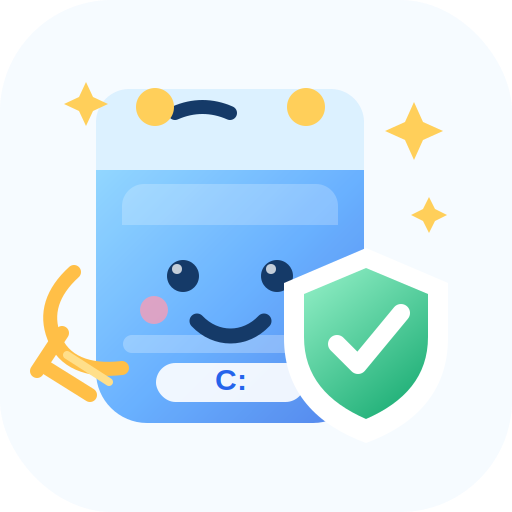

# Windows C 盘清理分级 Skill

<p align="center">
  
</p>

一个中文 Codex Skill，用来帮助用户在 Windows 上安全地理解 C 盘空间占用，并生成“能删 / 不能删 / 需要谨慎”的分级清理建议表。

核心原则：

- 先盘点，再分类，再分级，最后才执行。
- 默认只读，不删除、不移动、不修改文件。
- 系统目录和软件目录不盲删。
- 个人资料优先整理、备份或转移，而不是直接删除。

## 适用场景

当用户提出类似问题时，可以使用这个 Skill：

- “帮我看看 C 盘哪些能删，哪些不能删。”
- “C 盘满了，先帮我分类一下。”
- “把 C 盘里的文件按风险等级做一个表。”
- “我想清理电脑，但不想误删系统文件。”
- “帮我生成一个安全的 C 盘清理流程。”

## Skill 能做什么

这个 Skill 会引导 Codex 完成：

1. 只读盘点 C 盘空间和关键目录。
2. 把 C 盘内容分为系统核心、软件安装、用户资料、聊天文件、文献资料、缓存临时文件等类别。
3. 使用 A/B/C/D 四个等级判断删除风险。
4. 输出清晰的 Markdown 表格。
5. 给出优先处理清单。
6. 在用户要求真正清理前，先要求确认具体项目。

## 风险等级

| 等级 | 含义 | 操作建议 |
|---|---|---|
| A | 通常可删除 | 关闭相关软件后清理，或使用系统清理工具 |
| B | 确认后可删除或转移 | 先看内容，重要文件转移到非系统盘 |
| C | 不建议手动删除 | 使用系统工具、软件自带工具或先备份 |
| D | 不要删除 | 保持不动，交给 Windows 或对应软件管理 |

常见例子：

| 对象 | 等级 | 说明 |
|---|---|---|
| 回收站、用户临时文件、错误报告 | A | 通常可以清理 |
| 安装包、压缩包、旧视频、重复课件 | B | 先确认内容，再删除或转移 |
| 微信缓存、Zotero 附件、驱动目录、Windows 更新缓存 | C | 不建议直接手动删 |
| `C:\Windows`、`C:\Program Files`、`C:\Recovery`、`pagefile.sys` | D | 不要删除 |

## 安装方式

把整个 `windows-c-drive-cleanup` 文件夹放到 Codex 的 Skills 目录中。

常见位置：

```text
%USERPROFILE%\.codex\skills\windows-c-drive-cleanup
```

或者把它放进你自己的 Skills 仓库，再同步到目标机器。

目录结构应类似：

```text
windows-c-drive-cleanup/
├── SKILL.md
├── README.md
├── agents/
│   └── openai.yaml
└── scripts/
    └── inspect_c_drive.ps1
```

## 使用方式

在 Codex 中可以这样提问：

```text
使用 $windows-c-drive-cleanup 帮我分析 C 盘哪些能删哪些不能删。
```

也可以直接描述任务：

```text
我的 C 盘快满了，先不要删除任何东西，帮我分类并做一个风险等级表。
```

Skill 会优先进行只读盘点，然后输出类似这样的表格：

| 分类 | 位置/示例 | 当前观察 | 等级 | 是否能删除 | 建议 |
|---|---|---:|---|---|---|
| 系统核心 | `C:\Windows` | 系统目录 | D | 不能删除 | 不手动处理 |
| 安装缓存 | `C:\Autodesk` | 体积较大 | B | 确认后可处理 | 判断是否为安装缓存 |
| 用户资料 | `Documents` | 文档和聊天文件 | B/C | 谨慎 | 先备份或转移 |

## 只读盘点脚本

Skill 附带一个 PowerShell 脚本：

```text
scripts/inspect_c_drive.ps1
```

它只读取文件元数据并输出统计表，不会删除、移动、重命名、写入或修改任何文件。

手动运行示例：

```powershell
powershell -NoProfile -ExecutionPolicy Bypass -File ".\scripts\inspect_c_drive.ps1"
```

快速测试示例：

```powershell
powershell -NoProfile -ExecutionPolicy Bypass -File ".\scripts\inspect_c_drive.ps1" -MaxSecondsPerFolder 2 -MaxSecondsForFileTypes 10
```

参数说明：

| 参数 | 默认值 | 说明 |
|---|---:|---|
| `MaxSecondsPerFolder` | `8` | 每个目录最多统计多少秒 |
| `MaxSecondsForFileTypes` | `60` | 用户目录文件类型统计最多运行多少秒 |

脚本输出三张表：

1. `C drive summary`：C 盘总容量、已用空间、剩余空间。
2. `Folder size summary`：关键目录大小、文件数、是否为部分统计。
3. `User file type summary`：常见文档、压缩包、图片、音视频类型统计。

如果 `Partial` 为 `True`，表示该项受时间预算限制，只是部分统计结果。这是为了避免在文件特别多的电脑上长时间卡住。

## 安全边界

这个 Skill 不包含自动删除脚本。

即使用户要求“直接清理 C 盘”，也应该先输出待处理项目和风险等级，让用户确认具体路径或类别后再进行后续操作。

默认不要执行这些动作：

- 删除 `C:\Windows`
- 删除 `C:\Program Files`
- 删除 `C:\Program Files (x86)`
- 删除 `C:\Recovery`
- 删除 `System Volume Information`
- 删除 `pagefile.sys` 或 `swapfile.sys`
- 整体删除 `C:\Users\<user>`
- 直接删除微信、Zotero、浏览器等应用数据目录
- 使用递归删除命令清理模糊路径或通配符路径

推荐优先使用：

- Windows “设置 > 系统 > 存储”
- “磁盘清理”
- 微信或聊天软件自带的存储管理
- 软件自带卸载程序
- Windows “设置 > 应用”

## 维护建议

如果要扩展这个 Skill，建议优先保持三个约束：

1. `SKILL.md` 保持简洁，聚焦 Agent 执行流程。
2. 脚本默认只读，不加入自动删除逻辑。
3. 删除或移动动作必须放在用户二次确认之后。

如果未来要支持自动生成报告，可以新增报告模板，但不要把自动清理和只读盘点混在同一个脚本里。
